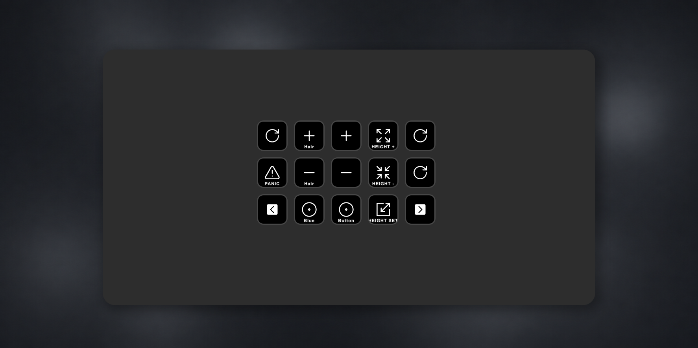
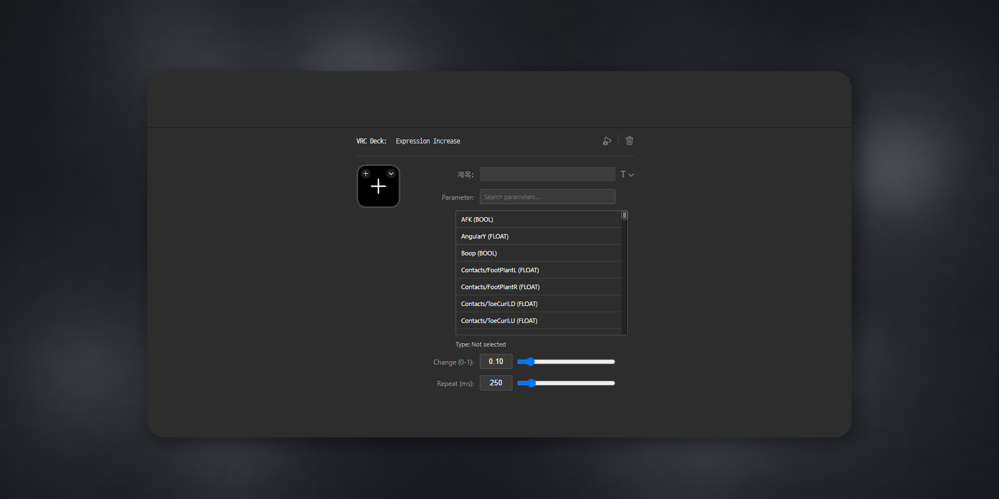
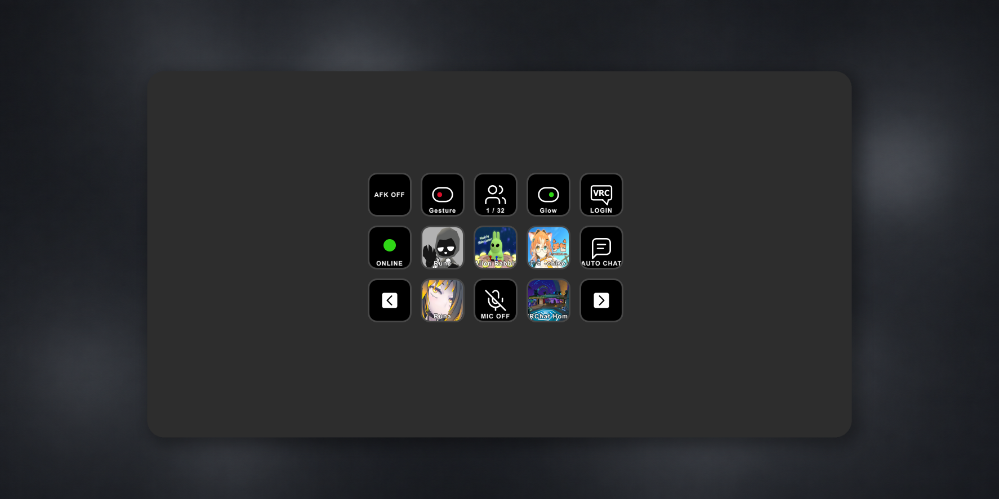

  

  # VRC Deck

  OSC와 VRChat API를 이용해 Stream Deck에서 VRChat을 제어하고 상태를 확인하세요.

  <a href="README.md">English</a> | 한국어

> VRC Deck은 비공식 커뮤니티 프로젝트이며 VRChat Inc. 또는 Elgato와 제휴하거나 공식 승인을 받은 제품이 아닙니다.

## 미리 보기

### Stream Deck 액션

### Expression 제어

### 사용 가능한 액션

## 기능

| 액션 | 설명 | VRC 로그인 |
| --- | --- | :---: |
| Mic Toggle | 마이크를 켜고 끄며 현재 상태를 실시간으로 동기화합니다. | 불필요 |
| AFK Status | 현재 VRChat AFK 상태를 표시합니다. | 불필요 |
| Avatar Height Increase | 버튼을 한 번 누르거나 길게 눌러 아바타 눈높이를 높입니다. | 불필요 |
| Avatar Height Decrease | 버튼을 한 번 누르거나 길게 눌러 아바타 눈높이를 낮춥니다. | 불필요 |
| Avatar Height Set | 아바타 눈높이를 설정한 값으로 변경합니다. | 불필요 |
| Expression Toggle | 아바타의 Bool Expression 파라미터를 토글합니다. | 불필요 |
| Expression Button | Bool, Int 또는 Float Expression 파라미터를 설정한 값으로 변경합니다. | 불필요 |
| Expression Cycle | Int Expression 파라미터를 설정한 범위 안에서 순환시킵니다. | 불필요 |
| Expression Increase / Decrease | 길게 누르기 반복을 포함해 숫자 Expression 파라미터를 증감합니다. | 불필요 |
| Auto Chat | 저장해 둔 메시지를 VRChat 채팅창으로 바로 전송합니다. | 불필요 |
| Panic Button | VRChat 안전 모드를 활성화합니다. | 불필요 |
| VRC Login | VRChat API를 사용하는 액션을 위해 로그인합니다. | — |
| Instance Status | 현재 인원 또는 월드 이름을 표시하며 월드 썸네일을 선택적으로 사용할 수 있습니다. | 필요 |
| Avatar Change | 사용 가능한 아바타를 검색하고 선택한 아바타로 변경합니다. | 필요 |
| Current Avatar | 현재 착용 중인 아바타의 이름과 썸네일을 표시합니다. | 필요 |
| Online Status | VRChat 온라인 상태를 순환하거나, 두 상태 사이에서 토글하거나, 지정한 상태로 변경합니다. | 필요 |

## 요구 사항

- Windows 10 이상
- Stream Deck 7.1 이상
- PC용 VRChat
- OSC 기반 액션을 사용하려면 VRChat OSC 활성화
- VRChat API 액션을 사용하려면 인터넷 연결 및 VRC Login

현재 Stream Deck +의 다이얼 조작은 지원하지 않습니다.

## 설치

1. [GitHub Releases](https://github.com/KONON-S2/vrc-deck/releases/latest)에서 최신 `.streamDeckPlugin` 파일을 다운로드합니다.
2. 다운로드한 파일을 실행합니다.
3. Stream Deck 앱에서 설치를 승인합니다.
4. 액션 목록에서 **VRC Deck**을 찾아 원하는 액션을 추가합니다.

## VRChat에서 OSC 활성화

1. VRChat을 실행합니다.
2. Action Menu를 엽니다.
3. **Options → OSC**로 이동합니다.
4. OSC를 활성화합니다.

VRC Deck은 OSCQuery를 통해 VRChat을 자동으로 검색하고 VRChat의 기본 OSC 입출력 인터페이스를 사용합니다.

## VRC Login

아바타 선택, 현재 아바타 정보, 인스턴스 정보 및 온라인 상태 제어 등의 일부 액션은 VRChat 계정 데이터 접근이 필요합니다.

1. **VRC Login** 액션을 Stream Deck 버튼에 추가합니다.
2. Property Inspector에 VRChat 사용자 이름 또는 이메일과 비밀번호를 입력합니다.
3. 요청되는 경우 2단계 인증을 완료합니다.
4. 로그인에 성공하면 비밀번호 입력란을 지워도 됩니다.

플러그인은 입력한 비밀번호를 보관하지 않습니다. Stream Deck을 다시 시작한 후에도 세션을 복원할 수 있도록 암호화된 VRChat 세션을 Stream Deck 전역 설정에 로컬로 저장합니다. 세션 데이터는 VRChat API에만 전송됩니다.

## Expression 파라미터

Expression 액션은 현재 착용 중인 아바타의 파라미터를 불러옵니다. 검색 가능한 목록에서 파라미터를 선택한 후 해당 타입에 맞게 액션을 설정하세요.

- Bool 파라미터는 토글하거나 `true` 또는 `false`로 설정할 수 있습니다.
- Int 파라미터는 값을 설정하거나 순환, 증가 또는 감소시킬 수 있습니다.
- 일반적인 아바타 Expression 제어에서 Float 파라미터는 `0.00`부터 `1.00`까지의 값을 사용합니다.

파라미터 목록이 비어 있다면 OSC가 활성화되어 있는지 확인한 후 아바타를 다시 불러오거나 한 번 변경해 보세요.

## 아바타 높이

아바타 높이 액션은 VRChat의 `/avatar/eyeheight` OSC 엔드포인트를 사용합니다. 플러그인은 시작 후 OSCQuery를 통해 현재 높이를 가져오고 이후 변경 사항을 수신합니다.

- 증가 기본 최댓값: `5.0 m`
- 감소 기본 최솟값: `0.2 m`
- 설정 가능 범위: `0.1–100 m`

월드에서 아바타 크기 조절을 제한하거나 비활성화할 수 있습니다. 이 경우 VRChat이 요청한 높이를 무시하거나 다른 값으로 적용할 수 있습니다.

## 중요 사항

- **Panic Button은 안전 모드를 활성화만 합니다.** 안전 모드는 VRChat Quick Menu에서 해제하세요.
- VRChat은 현재 안전 모드 상태를 OSC로 제공하지 않으므로 VRC Deck에서 안전 모드 활성화 여부를 표시할 수 없습니다.
- 인스턴스와 아바타 썸네일은 필요할 때 다운로드되어 플러그인 메모리에 캐시됩니다. VRC Deck이 별도의 이미지 파일로 저장하지는 않습니다.
- VRChat 세션이 만료되면 API 액션이 작동하지 않을 수 있습니다. VRC Login을 다시 사용해 접속을 복원하세요.

## 지원

문제는 [GitHub 저장소](https://github.com/KONON-S2/vrc-deck)를 통해 제보해 주세요.

피드백 및 기타 연락 수단은 [KONON 링크 모음](https://guns.lol/konon_s2)에서 확인할 수 있습니다.

문제를 제보할 때는 해당 액션, Stream Deck 버전, VRChat 모드(Desktop 또는 VR), 재현 절차를 포함해 주세요. 비밀번호, 세션 데이터 또는 기타 개인정보는 포함하지 마세요.

## 프로젝트 후원

VRC Deck이 마음에 들고 개발을 후원하고 싶다면 [Buy Me a Coffee](https://buymeacoffee.com/konon)를 이용해 주세요.
